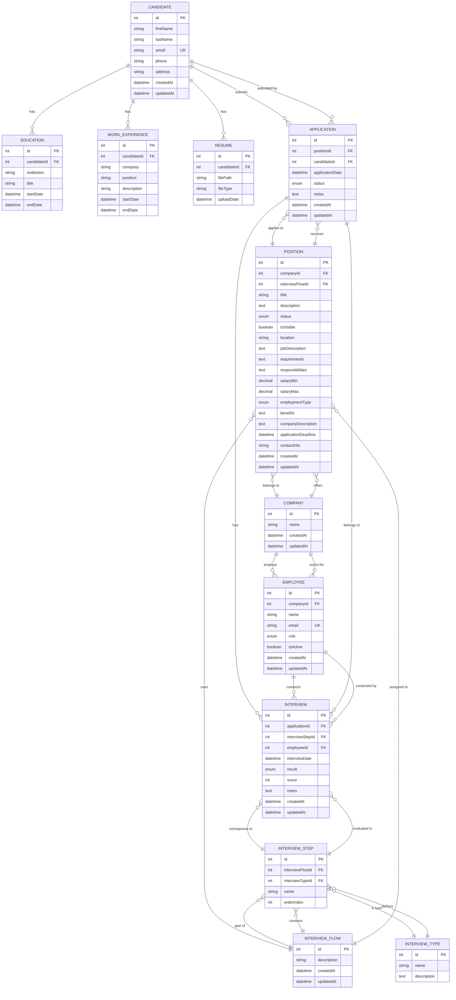
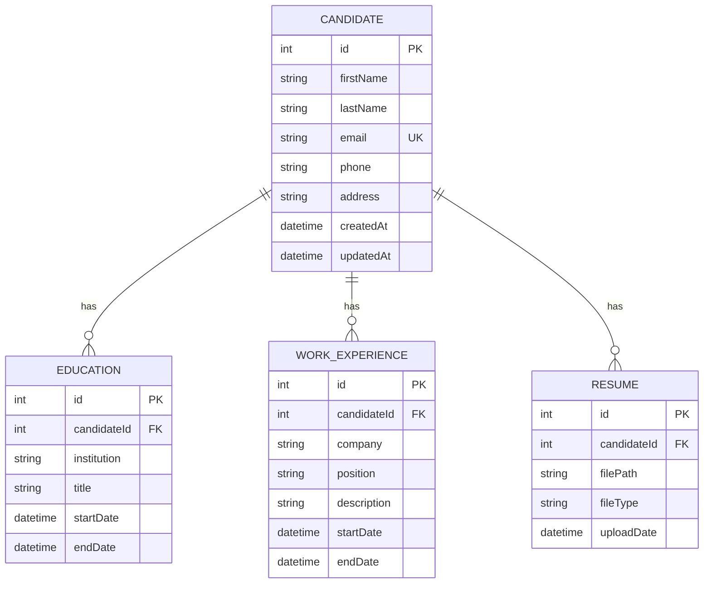
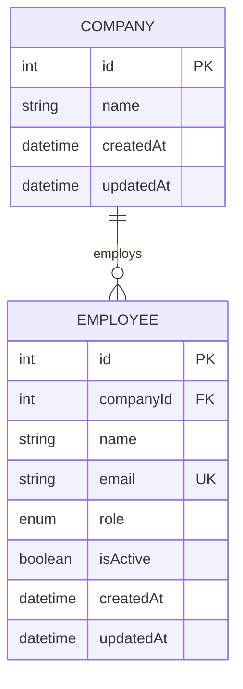
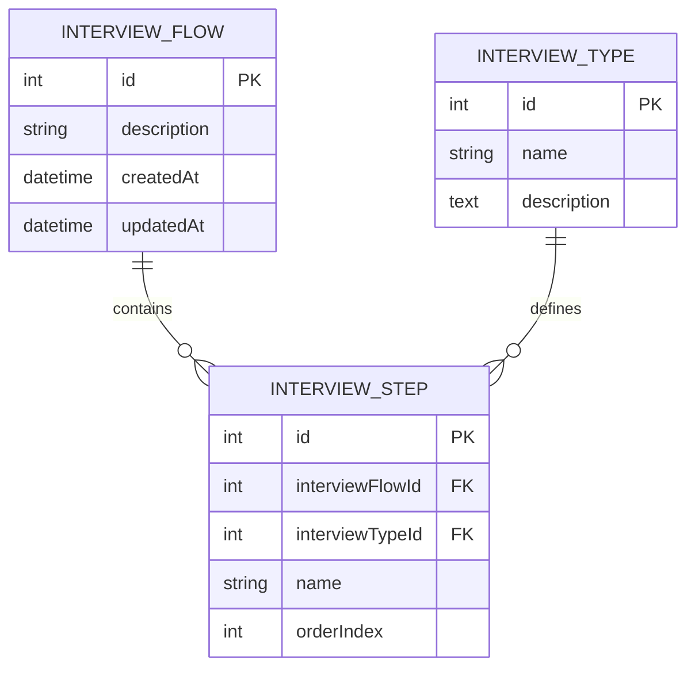
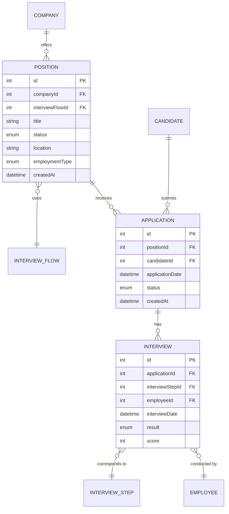

# Diagrama Entidad-Relación - LTI Talent Tracking System

**Versión:** 1.0  
**Fecha:** Noviembre 2025  
**Base de Datos:** PostgreSQL  
**ORM:** Prisma

---

## Diagrama ER Completo



---

## Diagrama por Módulos

### Módulo 1: Gestión de Candidatos



### Módulo 2: Gestión de Empresas y Empleados



### Módulo 3: Configuración de Entrevistas



### Módulo 4: Proceso de Reclutamiento



---

## Leyenda de Notación

### Cardinalidad
- `||--o{` : Uno a muchos (1:N)
- `}o--||` : Muchos a uno (N:1)
- `||--||` : Uno a uno (1:1)
- `}o--o{` : Muchos a muchos (N:M)

### Símbolos
- `PK` : Primary Key (Clave Primaria)
- `FK` : Foreign Key (Clave Foránea)
- `UK` : Unique Key (Clave Única)

### Tipos de Datos
- `int` : Integer (entero)
- `string` : VarChar (texto corto)
- `text` : Text (texto largo)
- `datetime` : DateTime (fecha y hora)
- `decimal` : Decimal (numérico con precisión)
- `boolean` : Boolean (verdadero/falso)
- `enum` : Enumeración (valores fijos)

---

## ENUMs del Sistema

### PositionStatus
```
DRAFT | OPEN | CLOSED | ON_HOLD
```

### EmploymentType
```
FULL_TIME | PART_TIME | CONTRACT | TEMPORARY | INTERNSHIP
```

### ApplicationStatus
```
PENDING | REVIEWING | INTERVIEWED | ACCEPTED | REJECTED | WITHDRAWN
```

### InterviewResult
```
PENDING | PASSED | FAILED | NO_SHOW
```

### EmployeeRole
```
RECRUITER | HIRING_MANAGER | INTERVIEWER | ADMIN
```

---

## Constraints Únicos

| Tabla | Campos | Descripción |
|-------|--------|-------------|
| Candidate | email | Email único por candidato |
| Employee | email | Email único por empleado |
| Application | positionId + candidateId | Un candidato solo aplica una vez por posición |
| InterviewStep | interviewFlowId + orderIndex | Orden único dentro de cada flujo |

---

## Políticas de Eliminación (onDelete)

### CASCADE (Eliminar en cascada)
- Candidate → Education, WorkExperience, Resume, Application
- InterviewFlow → InterviewStep
- Application → Interview

**Justificación:** Los registros hijos no tienen sentido sin el padre.

### RESTRICT (Prevenir eliminación)
- Company → Employee, Position
- Position → Application
- InterviewType → InterviewStep
- InterviewStep → Interview
- Employee → Interview

**Justificación:** Mantener integridad histórica y datos de referencia.

---

## Índices Principales

### Índices de Performance

| Tabla | Campos Indexados | Propósito |
|-------|------------------|-----------|
| Candidate | email | Búsqueda y unicidad |
| Employee | email, companyId, isActive | Búsqueda, joins, filtros |
| Company | name | Búsqueda por nombre |
| Position | status, location, employmentType | Filtros múltiples |
| Application | status, applicationDate | Filtros y ordenamiento |
| Interview | interviewDate, result | Filtros y reportes |
| InterviewType | name | Búsqueda por nombre |

### Índices de Foreign Keys

Todas las Foreign Keys tienen índices automáticos para optimizar JOINs:
- candidateId, companyId, positionId, interviewFlowId, interviewTypeId, interviewStepId, applicationId, employeeId

---

## Flujo de Datos Principal

### 1. Configuración Inicial
```
Company → Employee (Reclutadores)
InterviewType (Catálogo) → InterviewFlow → InterviewStep
Company → Position (asigna InterviewFlow)
```

### 2. Proceso de Aplicación
```
Candidate → crea perfil
Candidate → agrega Education, WorkExperience, Resume
Candidate → aplica a Position
System → crea Application
```

### 3. Proceso de Entrevista
```
Application → genera Interview (por cada InterviewStep)
Employee → conduce Interview
Employee → registra result y score
System → actualiza Application.status
```

### 4. Decisión Final
```
Application.status → ACCEPTED | REJECTED
Mantiene histórico completo de Interview
```

---

## Métricas y Queries Comunes

### Dashboard de Reclutador
```sql
-- Aplicaciones pendientes por posición
SELECT p.title, COUNT(a.id) 
FROM Application a
JOIN Position p ON a.positionId = p.id
WHERE a.status = 'PENDING'
GROUP BY p.id;

-- Entrevistas del día
SELECT c.firstName, c.lastName, p.title, i.interviewDate
FROM Interview i
JOIN Application a ON i.applicationId = a.id
JOIN Candidate c ON a.candidateId = c.id
JOIN Position p ON a.positionId = p.id
WHERE DATE(i.interviewDate) = CURRENT_DATE;
```

### Métricas de Position
```sql
-- Funnel de conversión
SELECT 
  p.title,
  COUNT(DISTINCT a.id) as total_applications,
  COUNT(DISTINCT CASE WHEN a.status = 'INTERVIEWED' THEN a.id END) as interviewed,
  COUNT(DISTINCT CASE WHEN a.status = 'ACCEPTED' THEN a.id END) as accepted
FROM Position p
LEFT JOIN Application a ON p.id = a.positionId
GROUP BY p.id;
```

### Performance de Entrevistadores
```sql
-- Entrevistas por empleado
SELECT 
  e.name,
  COUNT(i.id) as total_interviews,
  AVG(i.score) as avg_score
FROM Employee e
JOIN Interview i ON e.id = i.employeeId
GROUP BY e.id;
```

---

## Notas de Implementación

### Prisma ORM
Este diagrama ER está implementado usando Prisma ORM con las siguientes características:
- ✅ Tipado estático en TypeScript
- ✅ Migraciones automáticas
- ✅ Query builder type-safe
- ✅ Relaciones bidireccionales
- ✅ ENUMs nativos de base de datos

### PostgreSQL
Base de datos objetivo con soporte para:
- ✅ ENUM types nativos
- ✅ DECIMAL precisión para salarios
- ✅ TEXT sin límite para descripciones
- ✅ Índices compuestos
- ✅ Constraints UNIQUE múltiples

---

## Referencias Visuales

### Colores Sugeridos por Módulo (para documentación)

- 🔵 **Azul** - Módulo de Candidatos (Candidate, Education, WorkExperience, Resume)
- 🟢 **Verde** - Módulo de Empresas (Company, Employee)
- 🟡 **Amarillo** - Módulo de Configuración (InterviewFlow, InterviewStep, InterviewType)
- 🔴 **Rojo** - Módulo de Proceso (Position, Application, Interview)

---

## Herramientas para Visualización

### Online Mermaid Editors
- [Mermaid Live Editor](https://mermaid.live/)
- [GitHub Markdown](https://github.com) - Soporte nativo
- [Notion](https://notion.so) - Soporte con bloques code
- [VS Code](https://code.visualstudio.com/) - Con extensión Mermaid Preview

### Copiar y Pegar
Puedes copiar cualquier bloque de código Mermaid de este documento y pegarlo en las herramientas anteriores para visualización interactiva.

---

**Fin del Diagrama ER**

_Diagrama generado como parte del ejercicio HSO del módulo de bases de datos._

